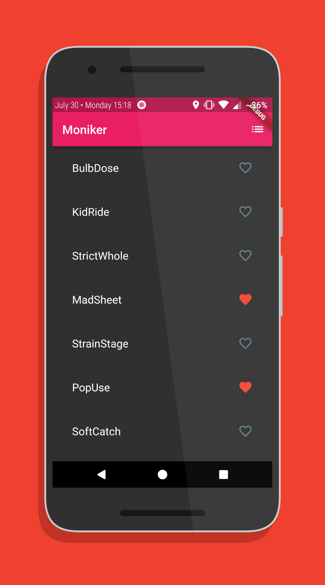
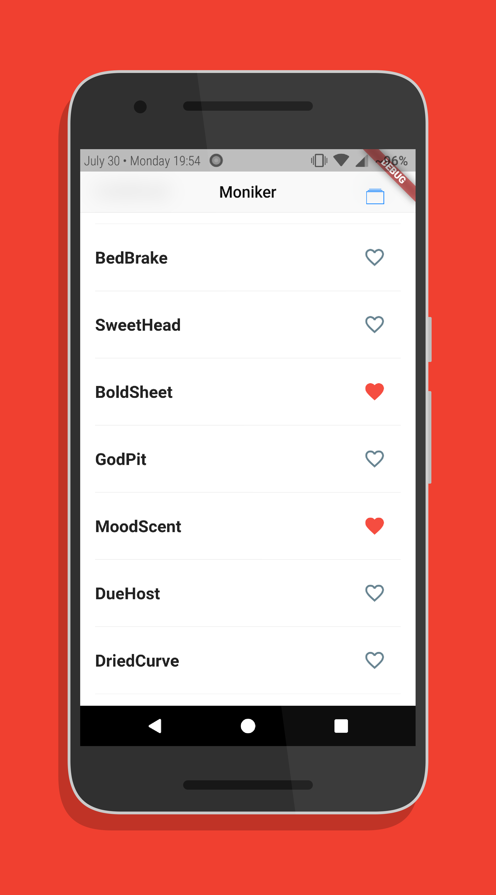
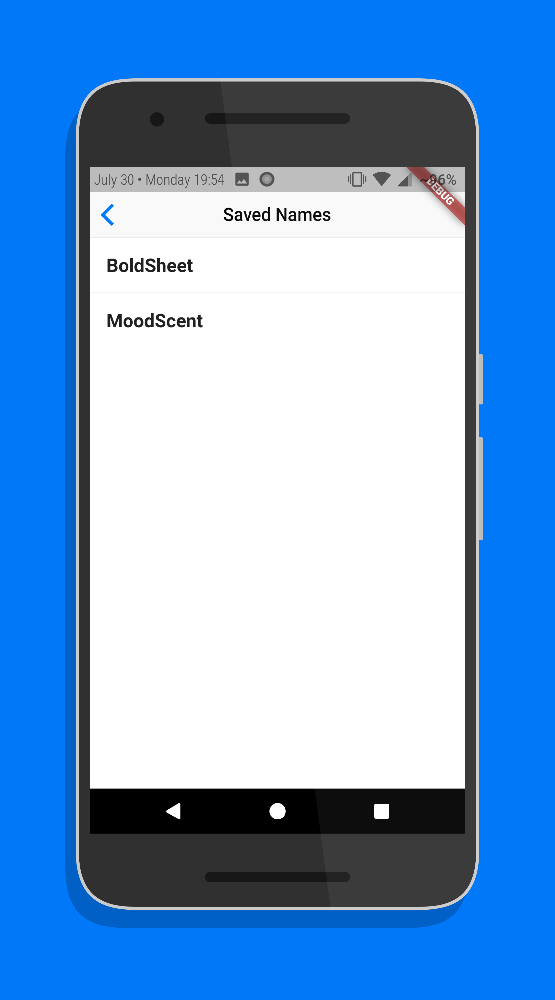

# Moniker

A Flutter app that generates random names for businesses.

**Note**: This app is available in both Material design and iOS-style design. Switch to `ios-style` branch to access the iOS-style version of the app.

## Screenshots

&ensp;

&ensp;

## Packages Used

* [cupertino_icons](https://pub.dartlang.org/packages/cupertino_icons)
* [english_words](https://pub.dartlang.org/packages/english_words)

## Developed By

Bapusaheb Patil

https://bapspatil.com

## License

    Copyright 2018 Bapusaheb Patil

    Licensed under the Apache License, Version 2.0 (the "License");
    you may not use this file except in compliance with the License.
    You may obtain a copy of the License at

        http://www.apache.org/licenses/LICENSE-2.0

    Unless required by applicable law or agreed to in writing, software
    distributed under the License is distributed on an "AS IS" BASIS,
    WITHOUT WARRANTIES OR CONDITIONS OF ANY KIND, either express or implied.
    See the License for the specific language governing permissions and
    limitations under the License.
